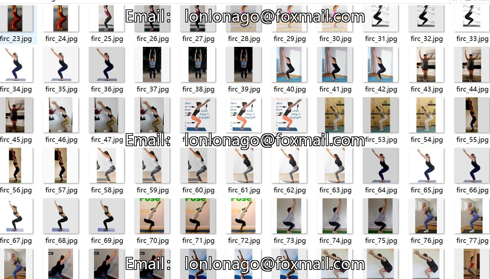
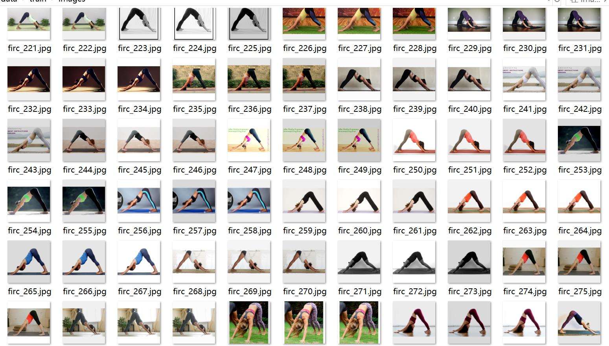
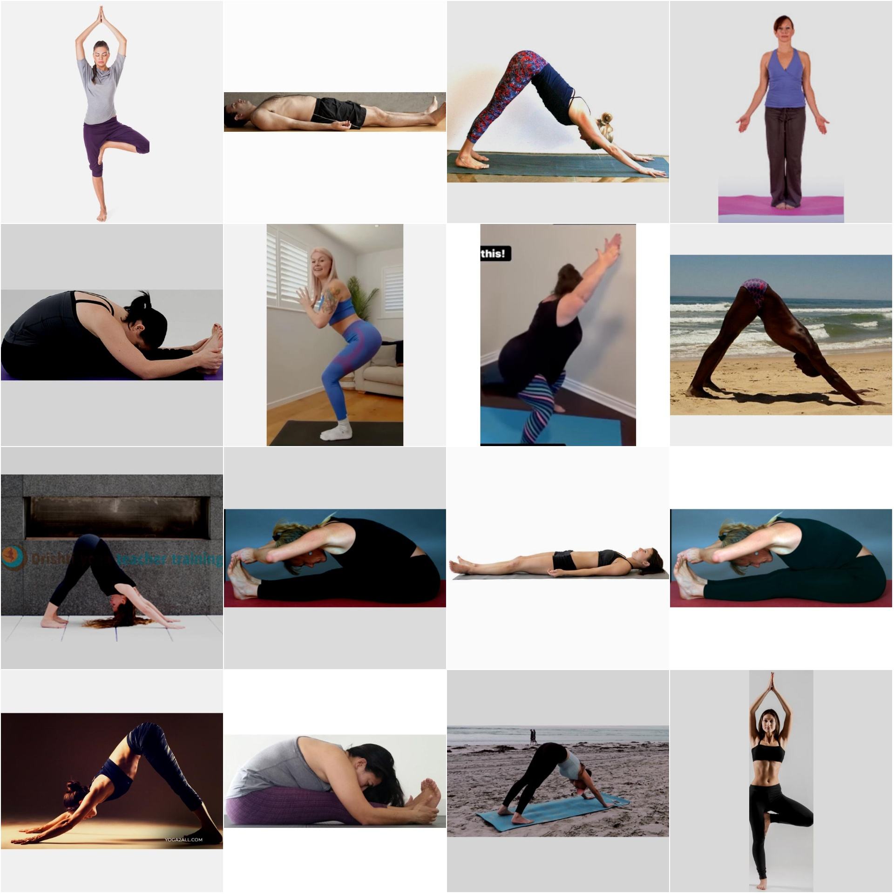
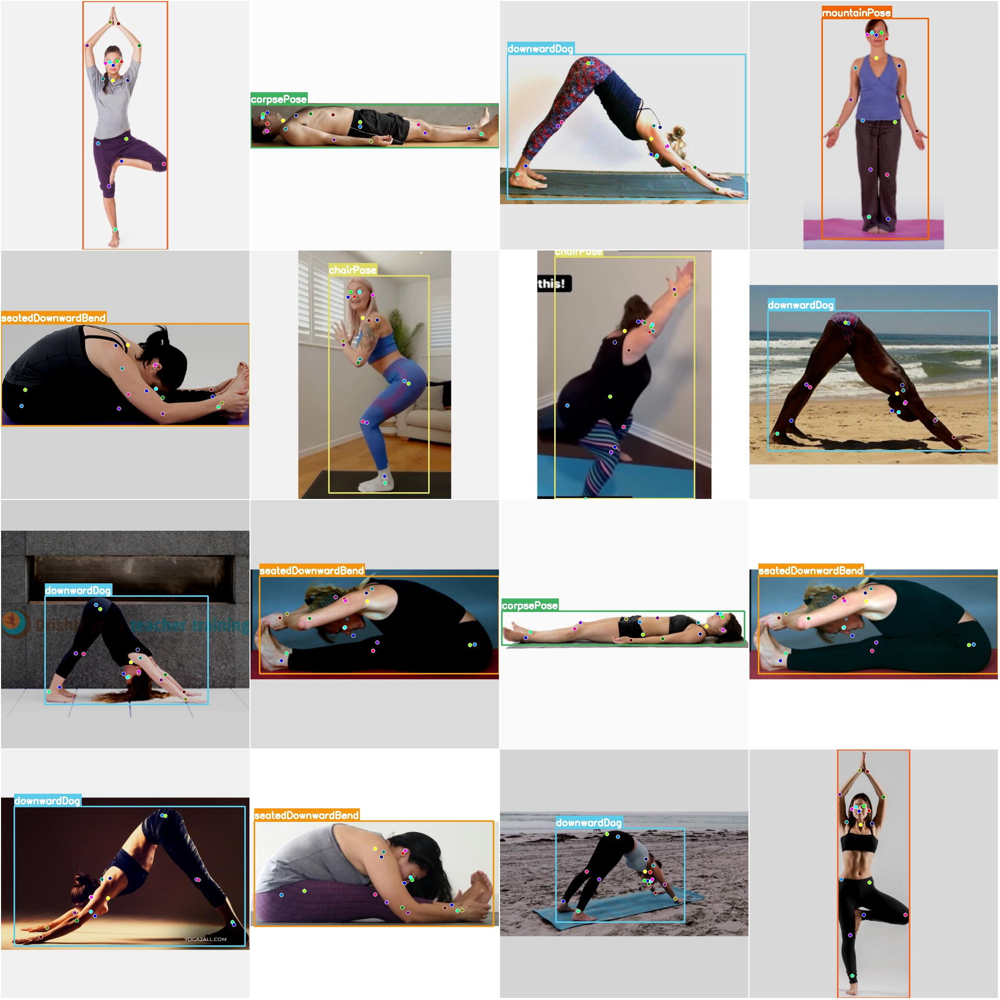

# YOLO-formatted Yoga Pose Detection Dataset: 728 Images, 6 Classes, 18 Keypoints

Note: Approximately 250 images are original and the remaining are enhanced.

**Dataset Format:** YOLO keypoint format (this is not the target detection or segmentation YOLO format, but merely includes JPG images and corresponding YOLO text files)

**Number of Images (JPG File Count):** 728
**Number of Annotations (Text File Count):** 728
**Training Set Count:** 672
**Validation Set Count:** 56
**Testing Set Count:** 0
**Number of Labeled Classes:** 6
**Labeled Classes Name:** ['chairPose', 'corpsePose', 'downwardDog', 'mountainPose', 'seatedDownwardBend', 'treePose']
**Number of Keypoints per Class:** 18

For each class:
- chairPose (Chair Pose) Keypoints = 107
- corpsePose (Corpse Pose/Lying Down) Keypoints = 127
- downwardDog (Downward Dog) Keypoints = 152
- mountainPose (Mountain Pose) Keypoints = 97
- seatedDownwardBend (Seated Downward Bend) Keypoints = 119
- treePose (Tree Pose) Keypoints = 126
Total Keypoints = 728

**Image Resolution:** 640x640

**Important Note:** The dataset has been divided into training, validation, and testing sets, which can be directly used for training models using Yolov5-pose, Yolov8-pose, Yolov11-pose, or 
Yolov26-pose.

**Special Reminder:** This dataset does not guarantee any precision in the trained models or weight files.

**Image Preview:**

Example Annotations:

Original images selected at random (16 images):

Annotation drawing results:

## Images

Here is a pay link on Stripe ( https://buy.stripe.com/3cs8yP7sY87d0vu9AB ). Please contact me lonlonago@foxmail.com after funding $89, and I will send you a complete data files , thank you!

